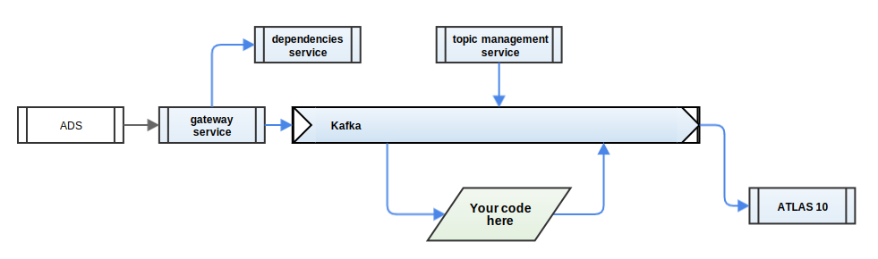

#  Atlas Advanced Streams

Atlas Advanced Streams is the transportation protocol over Kafka/MQTT used by MTAP.

# Table of Contents
- [**Concepts**](README.md#concepts)
  - [Design Concept](README.md#design-concept)
  - [Architecture Overview](README.md#architecture-overview)
  - [Topics, Streams and Sessions](README.md#topics-streams-and-sessions)
  - [It's all about Time](README.md#its-all-about-time)
  - [Data Feeds, Formats, and Views](README.md#data-feeds-formats-and-views)
  - [Atlas configuration](README.md#atlas-configuration)
- [**Specification**](README.md#specification)
  - [Streaming protocol](README.md#streaming-protocol)
  - [Protobuf extension](README.md#protobuf-extension)
- **Code Samples**
  - [C# samples](csharp/README.md)
  - [Python samples](python/README.md)
  
## Concepts
### Design Concept
#### Backbone

The core idea is to provide a backbone for streaming data in and out of the ATLAS ecosystem.

In particular, to perform external processing, simulation or aggregation of data, a process can:

-   be written in any common language
-   run anywhere in the infrastructure (track, factory or cloud)
-   receive decoded data without having to host a full ATLAS recorder
-   describe and generate new parameters or aggregates
-   publish the result to any other streaming process, ATLAS clients or store

Sources could include:

-   ATLAS recorders
-   Simulations
-   Sensors

Sinks could include:

-   ATLAS / SQL Race
-   Live displays
-   Big data streaming frameworks
-   Arbitrary data files

#### Key Advantages for Developers

-   Few dependencies
-   Easy to insert and export data
-   Easy to integrate with models
-   Standard model to connect distributed systems
-   API designed specifically for streaming data

#### Key Advantages for System Administrators

-   No multicast
-   Simple configuration to communicate to developers
-   All the complexity is contained in easily-managed services
-   Kafka infrastructure is easy to deploy and scale as needed
-   Will support Kerberos authentication and access control in all components

### Architecture Overview

ATLAS Advanced Streams is designed to work as part of your infrastructure, rather than as interconnected desktop applications.

Here is the overall picture:

Your code interacts with Kafka through a client library provided as nuget packages.

You will need to install supporting components either locally on your laptop, or somewhere central in your development network.

#### Apache Kafka

_Cluster-capable message broker._

In production, this should be run on Linux.

For developer machines, we have provided a simple command-line tool that provides an instant mini-broker with a small footprint. Requires Java 8 runtime.

#### MAT Streaming Topic Management Service

_Front end to manage Kafka topics._

Apache Kafka uses the concept of named, persistent topics – which can be browsed and configured for the desired data retention and scalability. 

The Topic Management Service provides a REST API and a web user interface to set topics up for use with ATLAS Advanced Streams. A C# client library for the REST interface is included.

Kafka can be managed with command-line tools, but this service provides a convenient web front-end to create, edit and delete topics.

MSI provided. Requires Java 8 runtime or later.

#### MAT Streaming Dependencies Service

_REST service containing schemas describing the streaming data._

This microservice stores reference data off-stream. This improves efficiency, helps support late-joining streams, and time-based data expiry. 
ATLAS Advanced Streams uses this service to describe topic parameter selection and ATLAS configuration – but it can be used for any reference data associated with a stream. 

Think of this as equivalent to managing CFG and PGV files - it takes that job away from Kafka for simpler management.

CFG: ECU Logging configuration. 

PGV: ECU Program Version File.

MSI provided. Requires .NET 4.5.2.

#### MAT Streaming Gateway Service

_Publishes subsets of parameters as engineering data topics._

It receives live data directly from the ADS using an embedded DST recorder.

ADS: ATLAS Data Server – a desktop application interfacing with MAT loggers and multicasting telemetry to ATLAS clients. 

DST recorder: Data Server Telemetry recorder (wideband)

MSI provided. Requires .NET 4.6.2 and a compatible SQL Race Recorder.

#### ATLAS 10 Recorder

_Records streaming data into ATLAS 10._

Provided as a ZIP file for this release. Future versions will likely ship in the ATLAS 10 installer.
### Topics, Streams and Sessions

#### Topics

A topic should represent a meaningful subset of parameters, where a consumer is likely to be interested in most of the data on the topic. It can carry multiple concurrent sessions, or streams.

For some use cases, it will make sense to send data from multiple origins over the same topic - for example, capturing data from a set of sensors.

To distinguish data from only a few major sources - such as each car - you may prefer to create separate topics, so they can be processed and recorded separately.

#### Streams

Streams are labelled sequences of messages within a topic. There can be many concurrent streams in one topic, which is particularly useful if there are many sources of data.

The ATLAS Advanced Streams API separates messages by stream to feed them into your code.

#### Sessions

Sessions are intended to be a close analogue of the ATLAS Session concept. A session represents a period of captured telemetry data. This could be a race, a test session or a journey.

They are implemented on top of streams, which means that you can have multiple concurrent sessions in a topic, and that the API will separate the sessions to feed them into your code.

The API includes special support for sessions:

-   List live and recently-historic sessions on a topic
-   Selectively replay a specific session

##### Identity

Sessions must declare an  `id`.

This forms part of the concept of data traceability, further qualified by:

`type`

Type of session. Defaults to  `StreamSession`; should not exceed 32 characters.

`quality`

A measure of the completeness of the data, as a number in the range 0.0 (no useful data) - 1.0 (complete). This reflects the limitations of streaming data over unreliable links with limited bandwidth. Defaults to  `0.9`.

##### Identifier and Details

Equivalent to the ATLAS concepts, the session identifier is equivalent to a filename, with details as attributes describing arbitrary metadata about the session.

The identifier and details can change dynamically as the session progresses.

##### Activity and Heartbeat

Sessions declare a start time and duration. Clients should update the duration as they are writing the session, as - like a file size - it is a useful reflection of the contents of the session.

The start time is a reflection of the data contained in the session, but the session also has a heartbeat, which reflects wall clock time as the session is streamed. The  `MAT.OCS.Streaming`  library maintains the heartbeat automatically.

The heartbeat services a secondary purpose: By repeating the current Session state at intervals, a client can acquire the session just by listening to the stream for a short period.

##### Lifecycle

Sessions declare a state, which transitions through this lifecycle:

`waiting`

The session is announced and described, but no data is being sent.  
This state is primarily intended to allow pipeline processing to initialize and process dependencies early, reducing latency through successive pipeline stages. Not currently exploited by the gateway service.

`open`

The session is sending data. The session description can still dynamically update after transitioning to Open.

`closed`

The session has stopped sending data, and downstream resources can be released. Clients should not send further session data after this point.  
This state has several sub-states:

`truncated`

The session closed without all data being sent.

`failed`

The session was truncated due to an error.

`abandoned`

The session was truncated due to being abandoned - perhaps due to a crash in an upstream process. This state would generally be set by a watchdog or cleanup utility, based on the lack of a heartbeat.

A session may not transition through all states. Entering a  `waiting`  state does not guarantee that the session will become  `open`, though it should enter  `closed`, or one of the  `closed`  sub-states. Once closed, however, it should not be re-opened.

##### Model

Sessions can declare model attributes:

`group`

Identifies the model category (e.g. "aero"). Should not exceed 255 characters.

`version`

Distinguishes between iterations of the model with different parameterisation. Defaults to  `0`  if no version is specified, so number from  `1`  upwards to use versioning.

`configuration`

Optional information capturing the model parameterisation.

These attributes characterise code being run in a pipeline, so that downstream clients can determine how a stream session has been transformed.

##### Sources

Sessions can declare a list of sources - which are themselves sessions. This recursive definition creates traceability back through a processing pipeline.

##### Dependencies

Dependencies are reference data stored outside the stream, that may be required to understand the stream content. The session declares them as lists of unique dependency identifiers, grouped together by type.

Dependencies are stored by the  [Dependencies Service](https://mclarenappliedtechnologies.zendesk.com/hc/en-us/articles/115003531373).

This concept creates separation between the lifetime of the stream and the dependencies. Stream messages may be retained for a comparatively short period, while the dependencies may be referenced indefinitely by many streams.

### It's all about Time

#### Timestamps and Epochs

ATLAS Advanced Streams measures time at nanosecond precision.

Whilst many systems use midnight on 1970-01-01 (UTC) as the time epoch (zero-point), TAG ECUs traditionally use midnight (local time) as the epoch, due to limitations in 48-bit floating point data precision.

To accommodate both approaches and ensure that all times are absolute, ATLAS Advanced Streams qualifies all times with an epoch - also in nanoseconds - relative to 1970. The absolute time, relative to 1970, is arrived at by summing the epoch and time together.

This scheme allows TAG ECU timestamps to be passed through unchanged, with the epoch indicating local time midnight.

#### Forward-only

In general, time within a session should increase monotonically.

There are few parts of the infrastructure that strictly require this guarantee, but it is fundamentally more difficult to create even simple stateful functions if a time period might be re-visited at any point.

#### Sync Points

Some processing might require information from multiple message types.

For example, a model might accumulate data until the end of a lap, and then take action depending on whether the lap was considered a new fastest lap.

Since there is no strict ordering between message types, it can be difficult to determine when all necessary information is available to complete a calculation. In the example above, does data arrive before, or after the lap trigger?

One way to resolve this is to add  `sync`  messages into the stream. These act like a barrier, informing downstream clients that information is complete and coherent up to that sync point. Sync messages should be sent at frequent intervals (e.g. 1Hz) to allow their use without unnecessary buffering.

In the example above, a client could buffer laps and telemetry data until a sync message is seen, and then process all data prior to the lap end time, with the knowledge that no telemetry data has been missed.

### Data Feeds, Formats, and Views

#### Data Feeds

ATLAS Advanced Streams divides telemetry data into named feeds.

A feed is essentially a sub-stream of data: a defined list of parameters at a specific frequency.

This has some useful properties:

-   Data can be streaming at the accuracy required, reducing bandwidth and processing effort
-   Multiplexing data from different sources is easier
-   Clients can bind onto feeds they are interested in

Feed names are arbitrary, but should be kept short as they are repeated in every data message.

For convenience, there is the concept of a "default" feed, which has an empty name ("").

#### Data Formats

The telemetry data messages are not self-describing, which implies there is a dependency describing the data format.

A data format can be defined using the library using a fluent builder syntax:
```
DataFormat.DefineFeed().
  Parameter(DataAggregateSelection.Avg, "vCar:Chassis").
  Parameters(DataAggregateSelection.Min | DataAggregateSelection.Max, "gLat:Chassis", "gLong:Chassis").
  BuildFormat();
```

In JSON this looks like:
```json
{
  "feeds": {
    "": {
      "parameters": [
        {
          "identifier": "vCar:Chassis",
          "aggregates": "avg"
        },
        {
          "identifier": "gLat:Chassis",
          "aggregates": "min, max"
        },
        {
          "identifier": "gLong:Chassis",
          "aggregates": "min, max"
        }
      ],
      "frequency": 100.0
    }
  }
}
```
This JSON is published as a dependency using the library  `DataFormatClient`, and every telemetry data message includes the resulting dependency identifier.

The data format id is in every message to allow a long-running stream to transition to including additional parameters. This would define a new data format, and therefore a new dependency identifier.

#### Binding a View

The library allows a client to define a view onto a feed: a list of parameters and aggregates it expects to see.

The effect of this view is that upstream sources can insert additional parameters into a feed without breaking client compatibility, as the view presents a stable list of parameters to the client code.

### Atlas configuration
A tree-like structure that defines the display structure of your data, using the following levels in the tree:

```python
AtlasConfiguration({"config_name":
        ApplicationGroup(groups={"group_name":
            ParameterGroup(parameters={"parameter_name":
                Parameter(name="parameter_display_name")})})})
```
Of course there can be multiple of each, hence the dictionary based tree-like structure.
Atlas configuration needs to be set and put to the dependency service only if you want to display your data in Atlas10.

#### AtlasConfiguration
Represents one or more ATLAS-compatible configuration sets. The key of an item should correspond to the app identifier/name (e.g. "Chassis").

#### ApplicationGroup
Represents all configuration for an application - equivalent to the ATLAS concept.

 - Conversions
 
 Conversion functions to translate samples into engineering values. Useful when injecting uncalibrated data into a stream, but any data sourced from a time-series store (like SQL Race) can usually be expected to be pre-calibrated, requiring no conversion. The dictionary key must correspond to the Conversion Id. This should be unique and of the form 'foo:{appname}'. For example: "SomeParamConv:MyApp". It is case-sensitive."
 
  - Conversion
  
  Conversion function - from a raw sample to an engineering value.
  
 - Events
 
 Definitions of events - which can happen at any particular moment, not aligned to a sample interval. The dictionary key must correspond to the Event Definition Id. This should be unique and of the form '{id:4}:{appname}'. For example: "02D4:MyApp". It is case-sensitive.

  - EventDefinition
  
  Defines an event - something that can happen independently of any sampling. Each Event can carry sample values, for context.
  There are three supported types of conversion function: RationalConversion, TableConversion, TextConversion
  
  - EventPriority
  
  Event priority. This concept is similar to common logging frameworks. Options are High, Medium, Low, Debug
  
- ApplicationId

Unique application id. Optional.

- RdaOwnerId

Unique team id, for RDA (Reduced Data Access). Optional.

#### ParameterGroup

Node in a tree of parameters. Contains both child groups and child parameters (leaf nodes).
ATLAS actually binds together group identifiers by concatenating group names together with underscore prefixes. We interpret that as meaning there isn't really a Description attribute as such - it's all just names. Needless to say the parameters are bound to the groups by the concatenated identifier

#### Parameter

Parameter within a ParameterGroup

 
## Specification
### Streaming protocol
#### Topics, Streams and Sessions

**Topic**

A topic should represent a meaningful subset of parameters, where a consumer is likely to be interested in most of the data on the topic. It can carry multiple concurrent sessions, or streams.

**Stream**

Streams are labelled sequences of messages within a topic. There can be many concurrent streams in one topic, which is particularly useful if there are many sources of data.

**Session**

Similar to the ATLAS Session concept, and necessary for interaction with the ATLAS ecosystem. Implemented on top of Streams.

For more information, read the article  [Topics, Streams and Sessions](README.md#topics-steams-and-sessions).

#### Time

Stream sessions use nanosecond data precision, relative to a specified epoch (also in ns).

For more information, read the article  [It's all about Time](README.md#its-all-about-time).

#### Message structure

Kafka messages have a key and a value.

##### Keys

In ATLAS Advanced Streams, the key is always structured in two parts, like this:

`<type>:<stream id>`

The  `type`  indicates the message content, which allows a client to select an appropriate parser for the message value. This article includes a defined list of message types, but a conforming client  _must_  accept (and likely ignore) other message types to allow extensibility.

The  `stream id`  distinguishes the stream to which the message belongs. Messages with the same stream id must be sent on the same partition to maintain message sequencing; note that this means that default Kafka stream of distributing messages by key hash must not be used.

Keys must be encoded as UTF-8 with no  [BOM](https://en.wikipedia.org/wiki/Byte_order_mark).

##### Values

The value format is determined by the message type.

Values are typically either empty, or well-formed JSON - see attached schemas.  
JSON values should be encoded as UTF-8 with no BOM.

Clients must not assume that  _all_  messages are JSON; future versions of the protocol may include more compact binary encodings, with their own message types.

#### Messages

##### $start

Indicates the start of a stream - enables clients to identify partial streams.\
Clients must not send stream messages before sending $start.\
This message has an empty payload.

##### $end

Indicates the end of a stream.\
Clients must not send stream messages after sending $end.\
This message has an empty payload.

##### session

Identifies the stream as a session.\
Contains descriptive metadata, traceability and references to dependencies.

The session message is repeated at intervals to ensure that a client can join a live session and establish all necessary context, and as a heartbeat so that clients can determine whether the upstream process generating the session is still alive.

Example:
```json
{
  "id": "f2b8755c-c426-4cdc-9e51-ee7cd95a7879",
  "state": "open",
  "identifier": "random_walk",
  "dependencies": {
    "atlasConfiguration": ["e7548e787967"],
    "dataFormat": ["9a9627b7bc25"]
  },
  "activity": {
    "start": "2017-11-19T15:00:00Z",
    "durationNanos": 30000000
  }
}
```

Notice the declaration of both  `dataFormat`  and  `atlasConfiguration`  dependencies. This is a minimum requirement to use the ATLAS 10 stream recorder.

[session.schema.json](resources/session.schema.json)

##### tdata

Contains telemetry data, on a common timebase.

Example:
```json
{
  "epoch": 1511091963784000000,
  "time": [10000000, 20000000],
  "data": [
    {
      "status": [1, 1],
      "avg": [0.0, 10.0]
    }
  ],
  "feed": "",
  "format": "9a9627b7bc25"
}
```

Aggregate arrays can include:  `avg`,  `min`,  `max`, &  `first`.\
Status values reflect results of data retrieval, and are defined as the following bitwise flags:

|Value|Name|Description|
|---|---|---|
|0|Missing|_Missing sample_|
|1|Sample|_Valid sample; if there is at least one sample in the interval._|
|2|Default|_Default sample; typically due to sensor failure._|
|4|Before Start|_Data was requested before the first available sample._|
|8|After End|_Data was requested after the last available sample._|
|16|Incomplete|_Interval included missing samples. Common when down-sampling._|
|32|Interpolated|_Sample is interpolated. Also common._|
|64|Pending|_Sample is being fetched. Unlikely to be seen in streams._|
|128|Gap|_Gap in data._|


These statuses provide detailed information for models that require it, but in general, all values are useful except when NaN.\
See  [Data Feeds, Formats and Views](README.md#data-feeds-formats-and-views)  for information about the  `feed`  and  `format`  fields.

[tdata.schema.json](resources/tdata.schema.json)

##### tsamples (v0.2.1+)

Essentially a simplified version of  `tdata`, primarily for data ingest - where aggregates and statuses are not useful.

Example:
```json
{
  "epoch": 1511091963784000000,
  "time": [10000000, 20000000],
  "data": [
    [0.0, 10.0]
  ],
  "feed": "",
  "format": "9a9627b7bc25"
}
```

[tsamples.schema.json](resources/tsamples.schema.json)

#### events

A discrete event at a given timestamp. These could be events such as gear shifts or doors opening.
The `values` array contains any numerical values associated with the event. The parameters of which are
described in the event definition.

Example:

```json
{
  "epoch": 1511091963784000000,
  "time": 10000000,
  "id": "IO2-2B02:TAG320BIOS",
  "status": "Active",
  "values": [
    10.0, 20.0
  ]
}
```

[events.schema.json](resources/events.schema.json)

##### lap

Denotes a lap trigger.

Example:
```json
{
  "number": 0,
  "epoch": 1511049600000000000,
  "time": 50639840000000,
  "type": "outLap",
  "triggerSource": 3
}
```

Trigger sources include:

|Value|Name|
|---|---|
|0|Main straight|
|1|Pit lane|
|2|Default|
|3|Telemetry start|
|4|Telemetry end|

These triggers give rise to business logic to describe the lap type, which is one of:  
`fastLap`,  `pitLane`,  `outLap`, or  `inLap`. The exact business logic is outside the scope of this specification and may vary slightly by race formula.

[lap.schema.json](resources/lap.schema.json)

##### sync

Sync messages create synchronization points across message types.

See  [It's all about Time](README.md#its-all-about-time)  for more information.

-   [lap.schema.json](resources/lap.schema.json)
-   [session.schema.json](resources/session.schema.json)
-   [tsamples.schema.json](resources/tsamples.schema.json)
-   [tdata.schema.json](resources/tdata.schema.json)

### Protobuf extension

The  _MAT.OCS.Streaming.Codecs.Protobuf_  package provides a faster, more-compact serialization for telemetry data and samples. Prefer this codec when working with large topics.

#### Enabling the Codec

##### Enabling in your code

Bring the package into your project using NuGet.

To register the codec to parse incoming data, call:\
ProtobufCodecs.RegisterCodecs();

To use the codec by default to both send and receive data, call:\
ProtobufCodecs.RegisterCodecs(true);

##### Enabling in the Gateway Service

This option is available from 0.7.0 (Beta 4).

Set the  _ProtobufCodecEnabled_  option to  _True_.

#### IDL

Use the IDL (attached to this page) to generate a parser in a wide range of languages.

For more information, see  [https://developers.google.com/protocol-buffers/](https://developers.google.com/protocol-buffers/)

-   [protocol.proto](resources/protocol.proto)
