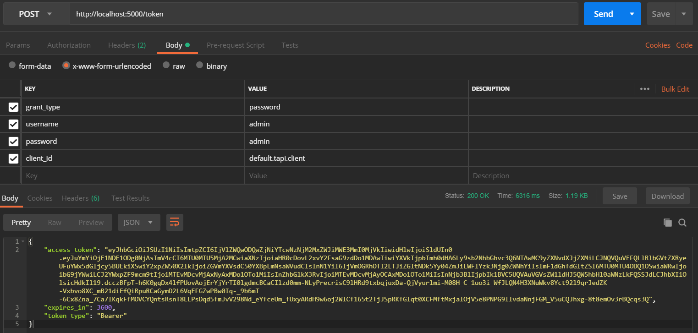
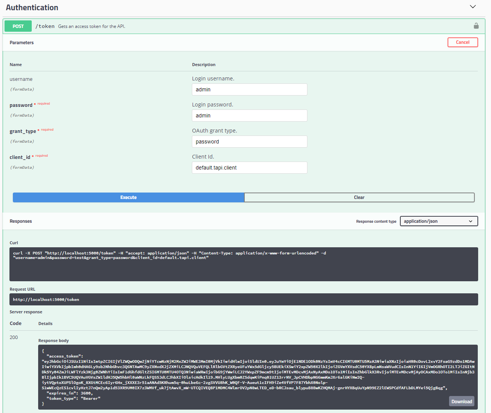

#  Identity Service

### Table of Contents
- [**Introduction**](../README.md)<br>
- [**Installation**](Installation.md)<br>
- **API**<br>
  - [User Management](#user-management)
  - [Client Management](#client-management)
  - [Authentication](#authentication)
  - [Roles](#differences-between-admin-and-default-user)

Identity Service API is documented using Open API (formerly Swagger) and is integrated with Swagger UI. UI is available at `<your-identity-service-addresss>/swagger/index.html`. Example: `http://localhost:5000/swagger/index.html`. Refer to that for specific endpoints, models. 

Depending on the version of Swagger UI, it might look slightly different, but when you visit it you should be presented with a list of endpoints. Each endpoint will provide you with example model as required. Explanation for each property of the model will also be provided. Swagger UI allows for trying out the endpoint in the browser. If any authentication is necessary, it can be usually set above the first listed endpoint on the right.

## User Management

Identity Service exposes several resources under `/users` path to manage TAP API user accounts.

#### Get Users

Url Mask:

```
GET api/{apiVersion}/users
```

Example:

```
GET api/v1/users
```

Result:

```
[
    {
        "id": "73c06464-54ae-4aa7-8495-6c2733dbd394",
        "userName": "admin",
        "validFrom": "2018-10-02T14:42:15.3909783",
        "validTo": "2018-12-02T14:42:15.391184",
        "role": "Admin"
    },
    {
        "id": "df127e7c-4c60-4344-b065-6d947a226dc7",
        "userName": "bob@example.com",
        "validFrom": "2018-09-02T00:00:00",
        "validTo": "2018-12-02T00:00:00",
        "role": "Default"
    }
]
```

#### Get User by Id

Url Mask:

```
GET api/{apiVersion}/users/{id}
 ```

Example:

```
GET api/v1/users/73c06464-54ae-4aa7-8495-6c2733dbd394
```

Result:
```
{
    "id": "73c06464-54ae-4aa7-8495-6c2733dbd394",
    "userName": "admin",
    "validFrom": "2018-10-02T14:42:15.3909783",
    "validTo": "2018-12-02T14:42:15.391184"
    "role": "Admin"
}
```

#### Create New User

Url Mask:

```
POST api/{apiVersion}/users
```

Example:

```
POST api/v1/users
```

Request Body:

```
{
  "userName": "test",
  "validFrom": "2018-10-02T14:42:15.3909783",
  "validTo": "2018-12-02T14:42:15.391184",
  "password": "testT1@"
  "role": "Default"
}
```

Result:

```
{
  "id": "1e958756-40e7-4886-b58f-13055df8847c",
  "userName": "test",
}
```

Remarks: "role" field is optional. If you do not specify a role,role defaults to "Default" user. In order to create an admin user,set "role" to "Admin".

#### Update Existing User

Url Mask:

```
PUT api/{apiVersion}/users/{id}
```

Example:

```
PUT api/v1/users/1e958756-40e7-4886-b58f-13055df8847c
```

Request Body:

```
{
    "id": "1e958756-40e7-4886-b58f-13055df8847c",
    "userName": "tes1t",
    "validFrom": "2018-10-02T14:42:15.3909783",
    "validTo": "2018-12-02T14:42:15.391184",
    "role": "Default"
}
```

Important: You need to provide user id and username in request body.

#### Reset Password

Resetting password is similar to updating an existing user. However, in addition to user Id and username,  you need to also provide the old password for validation.

Url Mask:

```
PUT api/{apiVersion}/users/{id}
```

Example:

```
PUT api/v1/users/1e958756-40e7-4886-b58f-13055df8847c
```

Request Body:

```
{
    "id": "1e958756-40e7-4886-b58f-13055df8847c",
    "userName": "tes1t",
    "oldPassword": "testT1@",
    "password": "testT1@new"
}
```

#### Delete User

Url Mask:

```
DELETE api/{apiVersion}/users/{id}
```

Example:

```
DELETE api/v1/users/1e958756-40e7-4886-b58f-13055df8847c
```
<br>

## Client Management

Identity Service exposes a resource under `/clients` path to create new TAP API clients.

#### Create New Client

Url Mask:

```
POST api/{apiVersion}/clients
```

Example:

```
POST api/v1/clients
```

Request Body:

```
{
  "clientId": "mvc.client",
  "clientName": "MVC Client for TAPI",
  "accessTokenLifetime": 3600,
  "allowRefreshToken": true,
  "refreshTokenLifetime": 3600
}
```
Parameter explanation:

 - `clientId`: Unique client identifier (required). 
 - `clientName`: Descriptive name identify the client.
 - `accessTokenLifetime`: Determines the period of validity of the access token in seconds. Must be larger than or equal to 1. It is recommended to keep the lifetime of the access token short and use the refresh token to renew access token. Default value is 1 hour.
 - `allowRefreshToken`: Flag indicating whether to allow the client to refresh the access token without requiring username and password.
 - `refreshTokenLifetime`: Determines the period of validity of refresh token in seconds. Set this to 0 to reuse the same refresh token.

<br>

## Authentication
#### Getting an Access Token

To get an authentication token you have to use `/token` endpoint with parameters `username`, `password`, `grant_type` and `client_id` in the body of the request as url encoded form data.

```
POST /token
```

Note that default values for ```username```, ```password``` and ```client_id``` in a new installation of the service are **"admin"**, **"admin"** and **"default.tapi.client"** respectively. Field ```grant_type``` is always the same value as **"password"**.

Following images shows an example of this type of request:

Postman:



Swagger UI:



The ```access_token``` field of the result provides the bearer token that you require. The token expires in the number of seconds returned in JSON. If you have configured the client to allow using a refresh token, you may also see the field ```refresh_token``` in the response. More information on how to use the refresh token can be found in [Using Refresh Token](#using-refresh-token) section.

To use the token, set `Authorization` header to `Bearer {{access_token}}` where `{{access_token}}` is the value of the `access_token` field returned.

Swagger UI example to use token:


#### Using Refresh Tokens

Refresh token allows the client to continue using the APIs in the absence of resource owner. By hitting the token endpoint with the refresh token periodically, access token continues to remain valid. To refresh the token, use the parameters ```client_id``` (your client id), ```grant_type``` (set to ```refresh_token```) and ```refresh_token``` (set the value of your refresh token) in the body of the request as url encoded form data.

```
POST /token
```

Note that unless otherwise configured, your refresh token will change each time you refresh the token. More information about configuring refresh token, refer to [create new client](#create-new-client) section.

## Differences between Admin and Default User

The Admin user can access all the API resources available while Default user is unable to or has restricted access to the following resources.

 - User management APIs: Default user can only view information related to his/her own account. Default user cannot view other user profiles, cannot create/update/delete any user account.
 - Client management APIs: Default user can register clients under his/her account.

Since, admin account has unrestricted access to all resources, please change the credentials (username/password) of the admin user as soon as possible after setting up the service. Also, follow usual precautions with passwords such as using strong passwords (our API enforces some restrictions on valid passwords) and changing them regularly.