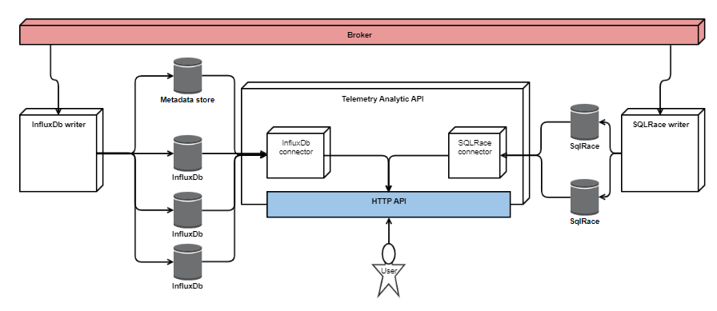

#  Telemetry Analytics API

### Table of Contents
- **Introduction** 
- [**Installation**](docs/Installation.md) 
- [**Getting started**](docs/GettingStarted.md) 
- [**Authorization**](docs/Authorization.md) 
- [**Querying Metadata**](docs/Metadata.md) 
- [**Consuming Data**](docs/ConsumingData.md) 
- [**Session Versions**](docs/SessionVersions.md) 
- [**Views**](docs/Views.md) 

The Telemetry Analytics API (TAPI) service provides programmatic access to persisted stream data. The REST API provides access to session metadata, telemetry data and model results. Additionally, the API exposes data analytic features such as data/metadata masking and filtering, aggregation and grouping. The service is configured via a REST API.

