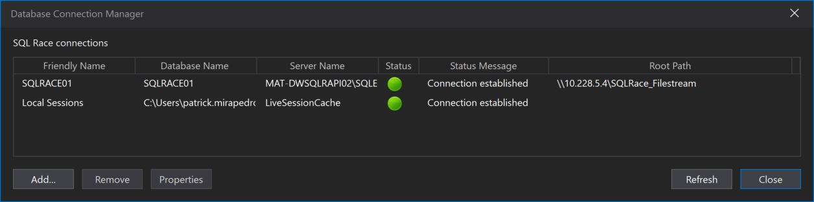
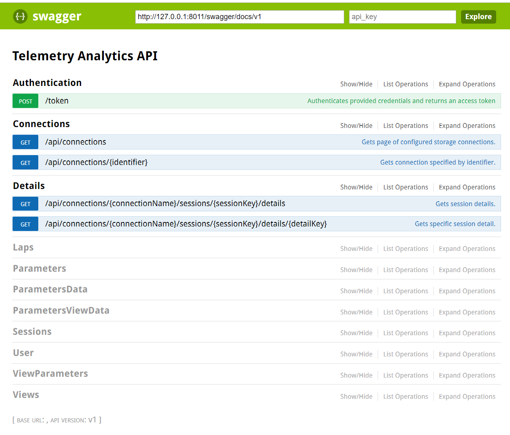

#  Telemetry Analytics API

### Table of Contents
- [**Introduction**](../README.md)<br>
- [**Installation**](Installation.md)<br>
- **Getting started**<br>
- [**Authorization**](Authorization.md)<br>
- [**Querying Metadata**](Metadata.md)<br>
- [**Consuming Data**](ConsumingData.md)<br>
- [**Session Versions**](SessionVersions.md)<br>

# Getting Started 

The TAP API microservice(s) must be configured to one or more specified data sources. 

[Postman](https://www.getpostman.com/) or [Swagger](#swagger) or your own automation software can be used to configure the API.
A [TAP Data Explorer](#tap-data-explorer) web application is also provided to help explore available data. 

## Get a bearer token
The TAP API requires an authenticated user.
Get a bearer token from the [**Identity Service**](/IdentityService/README.md)
	- For an example of this, see the [Authorization](Authorization.md) page (but change the username and password)

## Configure the data connections

The TAP API allows connections to be queried (GET), created (POST), updated (PUT) and deleted (DELETE). In order to create, update or delete, you must be a user with the admin role.

### InfluxDb Connections

Before being able to use the API to query the system, configure the InfluxDB connection(s) (`api/v1/connections`) to match the [InfluxDb Writer](/InfluxWriter/README.md) configuration(s). 

### Description:

The data can be stored in multiple influxDB instances using the topic name and the label in the connection settings.
This allows the system to scale the data horizontaly and separate it according to different labels.

You can create a new connection using a `POST` request:

```
POST api/v1/connections
```

Request:
```Json
{
  "influxDbDetails": [
    {
      "topicName": "Topic",
      "label": "Driver1",
      "influxDbUrl": "http://localhost:8000",
      "influxDbDatabase": "Database1",
      "measurementName": "Marple"
    },
    {
      "topicName": "Topic2",
      "label": "*",
      "influxDbUrl": "http://localhost:8000",
      "influxDbDatabase": "Database1",
      "measurementName": "Furnels"
    }
  ],
  "identifier": "Season2017",
  "sqlServerConnectionString": "server=.\\SQLEXPRESS;Initial Catalog=Database;User Id=UserId;Password=Password;"
}
```

Result:
```Json
[
  {
    "influxDbDetails": [
      {
        "topicName": "Topic1",
        "label": "*",
        "influxDbUrl": "http://localhost:8000",
        "influxDbDatabase": "Database1",
        "measurementName": "Marple"
      },
      {
        "topicName": "Topic2",
        "label": "*",
        "influxDbUrl": "http://localhost:8000",
        "influxDbDatabase": "Database1",
        "measurementName": "Furnels"
      }
    ],
    "identifier": "Season2017",
    "sqlServerConnectionString": "server=.\\SQLEXPRESS;Initial Catalog=Database;User Id=UserId;Password=Password;"
  },
  *...*
```

- `topicName` is the name of the topic used to stream data.
- `label` label can be used to split sessions within a topic. *Note: If no label is specified then this will be used as the default one.*
- `influxDbDatabase` is the name of the influx db database.
- `influxDbUrl` is the address of the InfluxDb instance used to store data.
- `measurementName` is the name of the measurement used to store parameter samples within the influx database. Good practice to use topic name and label combination (without special characters), but it can be anything.
- `identifier` is a string that uniquely identifies the connection.
- `sqlServerConnectionString` is the connection string of the SQL database that stores session metadata.

You can also update and delete existing connections using `PUT` and `DELETE` requests based on the **connection identifier**. Please refer to the [Swagger UI](#swagger) for more information.

### SqlRace Connections

SQLRace connections retrieved via api/v1/connections are from the shared SQLRace configuration on the server. If you are working locally with this API service you can configure these connections using ATLAS 10 or SQLRace client. You can access connections configuration from Atlas 10 via Options -> Database Connection Manager:




Telemetry Query API could be connected to multiple sources of data. You can query these sources with the following endpoint:

```
GET api/v1/connections
```

Result:
```json
[
    {
        "ServerName": "SqlRace-RESTAPI\\SQLEXPRESS",
        "IsSqlite": false,
        "DatabaseName": "SQLRACE01",
        "Identifier": "Season2017",
        "RootPath": "C:\\SQLRace_Filestream"
    },
    {
        "ServerName": "DbEngine=SQLite;Data Source=C:\\Users\\AdminRestApi\\AppData\\Local\\McLaren Applied Technologies\\ATLAS 10\\SQL Race\\LiveSessionCache.ssn2;PRAGMA journal_mode=WAL;",
        "IsSqlite": true,
        "DatabaseName": "C:\\Users\\AdminRestApi\\AppData\\Local\\McLaren Applied Technologies\\ATLAS 10\\SQL Race\\LiveSessionCache.ssn2 ",
        "Identifier": "Live Session Cache",
        "RootPath": null
    }
]
```

# Swagger

TAP API natively supports the **Open API** (formerly Swagger) API documentation format. It also integrates a version of **Swagger UI**, to display and test all the API endpoints in a interactive way. You can access the Swagger UI using the following url from a web browser:

```
http://{tap api hostname}:{port}/swagger
```



For more information about Swagger see the [Swagger website](https://swagger.io/).

# TAP Data Explorer
_This tool is in preview_.<br>
The TAP data explorer is provided to assist integrators with understanding what data is available in the system, and via the browser developer console (F12), the requests that are made by the web application can be copied and used in your own application.

```
http://{tap api hostname}:{port}/explorer
```
