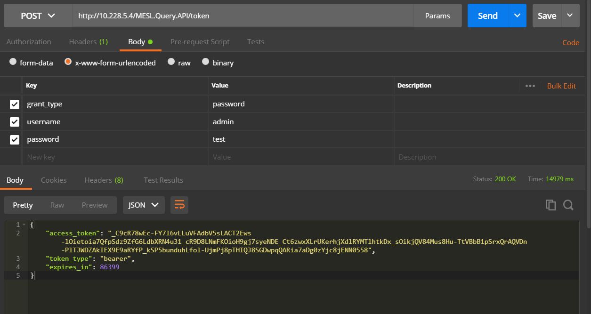
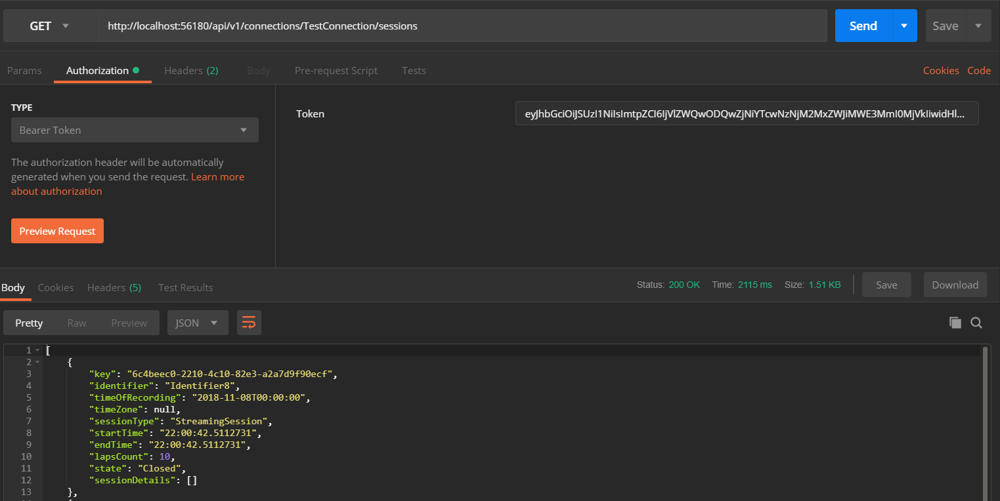
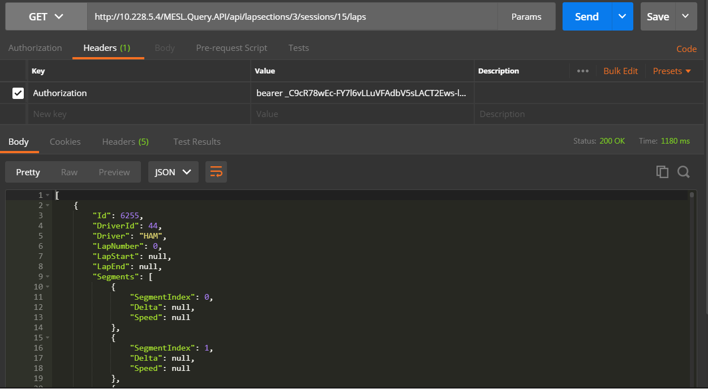
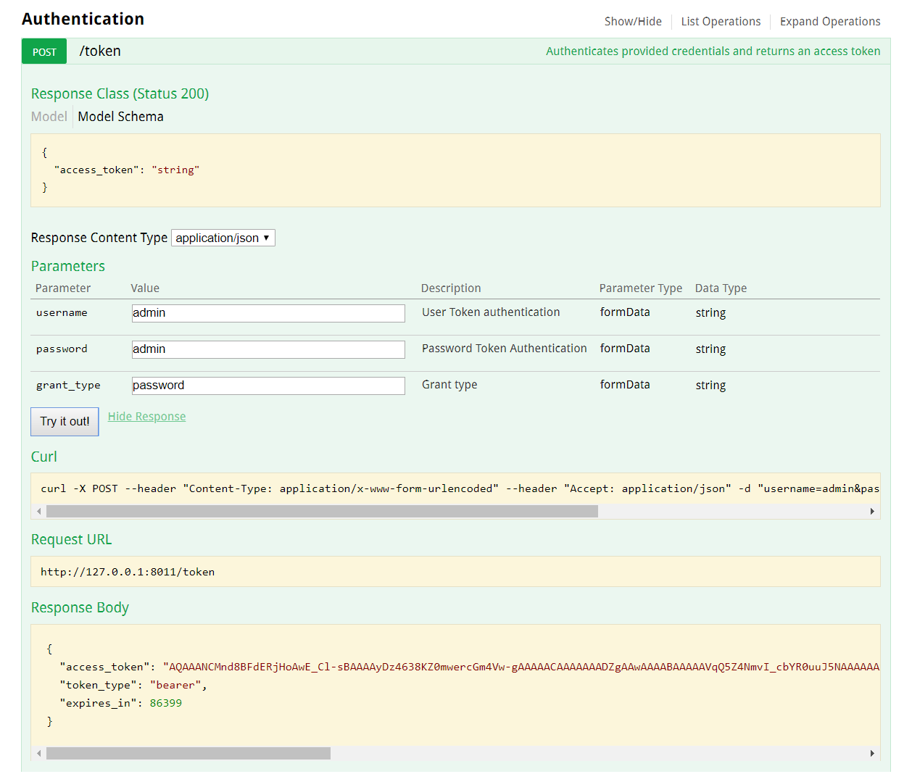
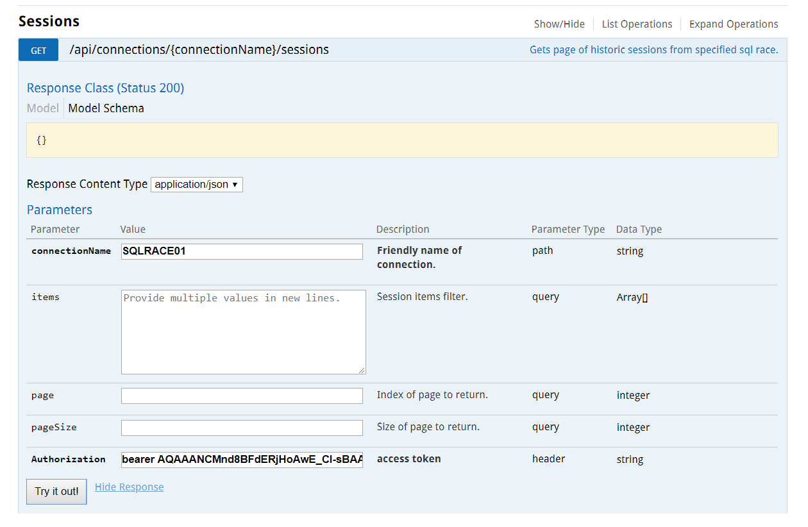

#  Telemetry Analytics API

### Table of Contents
- [**Introduction**](../README.md)<br>
- [**Installation**](Installation.md)<br>
- [**Getting started**](GettingStarted.md)<br>
- **Authorization**<br>
  - [Influx API](#influx-api-authentication)
    - [API Roles](#differences-between-admin-and-default-user)
  - [SQLRace API](#sqlrace-api-authentication)
- [**Querying Metadata**](Metadata.md)<br>
- [**Consuming Data**](ConsumingData.md)<br>
- [**Consuming Events**](ConsumingEvents.md)<br>
- [**Session Versions**](SessionVersions.md)<br>

# Authentication

The TAP API supports OAuth2.0 Resource Owner authentication. You use your username/password to ask the server for an access token (bearer token), which you will include in the headers of all requests to the server.

# Influx API Authentication

For the InfluxDB TAP API, the OAuth server is the [Identity Service](/IdentityService/README.md) and is deployed as a separate service. Please refer to the [Identity Service](/IdentityService/2019.1/docs/API.md#Authentication) documentation for authentication.

The TAP API for InfluxDB supports role-based access. Currently, the API supports two roles: `Admin` and `Default` user. The role-based access control system is implemented using user claims making it more general and flexible. When you first setup the Identity Service, an admin account will automatically be created for you as described in [Getting Access Token](#getting-an-access-token) section.

## Differences between Admin and Default User

 - TAP API Resources: Default user can access all TAP API resources with restricted access to the connections resource. Under connections resource, a default user can only access connection identifiers. Create/update/delete connections or viewing detailed information of connections such as connection strings requires an Admin account.

It is good practice to use TAP API via user account with `Default` role and only use `Admin` accounts for privileged tasks such as connection management.

# SQLRace API Authentication

For the SQLRace TAP API, the Oauth server is embedded, therefore you can use the same API to get access token.
The authentication flow is nearly identical to that of [Identity Service](/IdentityService/2019.1/docs/API.md#Authentication) with the exception of no `client_id`. The flow is described below for SQLRace API.

This authentication does not support roles.

### Getting an Access Token

To ask for a token you have to use the following endpoint with parameters `username`, `password` and `grant_type` in the body of the request as url encoded form data:

```
POST /token
```

Note that default values for ```username```, ```password``` in a new installation of the API are **"admin"**, **"admin"** respectively. Field ```grant_type``` is always the same value as **"password"**.

Postman example:



The ```access_token``` field of the result provides the bearer token that you require. The token expires in the number of seconds returned in JSON.

# Validate Access Token with Postman

In order to test the token obtained, try getting the sessions in the database using `/api/v1/connections/{connection name}/sessions`. Before making the GET request, navigate to **Authorization** tab in Postman, under **TYPE** dropdown, select **Bearer Token** and paste the access token you obtained from the token endpoint in the textbox next to **Token** as shown below. If the token is valid, you will get `200 OK` response and will be able to see sessions in the database if there is any. If the token is invalid, you will receive `401 Unauthorized` response:



Equivalently, you can navigate to **Headers** tab in Postman and enter **Authorization** as **Key** and keyword "bearer" followed by a space and the Token string as **Value**:



# Testing Authentication with Swagger UI
### Influx TAP API

You can verify the access token with any of the available controllers in Swagger UI. At the top of the page, click on **Authorize**, enter **"Bearer"**, followed by a space and paste the access token from the previous request and click on **Authorize** as shown in the image. You only need to set token once per session with Swagger UI. It will automatically be included in the headers for subsequent requests unless you logout using the **Logout** button in **Authorize** or the token expires.


Now, try using any of the controllers except `/api/v1/configuration`, as that does not require authorization. If the token is successfully authenticated then you will see a success (20x) response, otherwise, you will get `401 Unauthorized` as response.


### SqlRace TAP API

If you are using Swagger UI to test the API you can ask for a token accessing to the  **Authentication** controller in the own interface of the Swagger UI main page. You only need to fill up the fields ```username``` and ```password``` and press the button **"Try it out"**:



The resulting field ```access_token``` gives you the bearer token that you must use in the rest of endpoints of the Swagger UI. All the endpoints that need authorization ask you for filling up an additional field named ```Authorization```. You must to put in this field the keyword **"bearer"** followed by a space and the **Token** string provided for the previous call to the **Authentication** controller.

Following images shows an example of how to use it:

